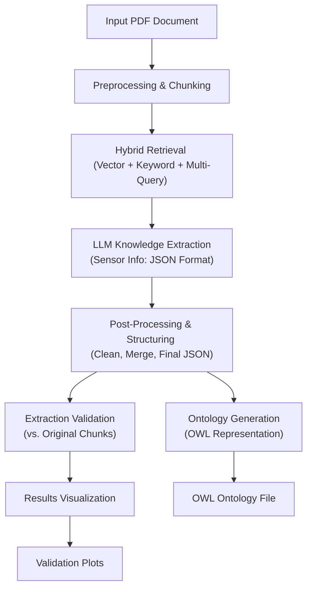

1. **Preprocessing & Chunking:** The input PDF is loaded, cleaned, and split into manageable text chunks.
    
2. **Hybrid Retrieval:** Relevant chunks containing potential sensor information are retrieved using a combination of semantic (vector search via FAISS/Ollama), keyword (BM25), and query expansion (Multi-Query) techniques.
    
3. **LLM Knowledge Extraction:** The content from the relevant retrieved chunks is fed to a Large Language Model (Ollama) with specific instructions (prompt) to extract structured information (entities like sensors, parts, properties, etc.) in a preliminary JSON format.
    
4. **Post-Processing & Structuring:** The raw JSON outputs from the LLM are cleaned, normalized, and merged to create a final, deduplicated structured JSON dataset representing the extracted sensor knowledge.
    
5. **Ontology Generation:** The structured JSON data is transformed into a formal OWL ontology using owlready2, defining classes and relationships based on the extracted information. This results in an .owl file.
    
6. **Extraction Validation:** The extracted sensor information (from the structured JSON) is compared against the original document chunks using string, fuzzy, and semantic matching techniques to assess accuracy and calculate confidence scores.
    
7. **Results Visualization:** The validation scores are plotted to visually analyze the performance and reliability of the extraction process. This results in plot images.
