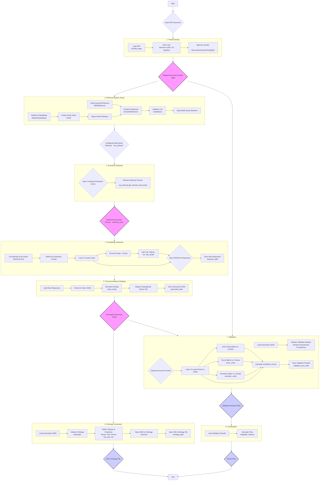

```mermaid
graph TD

    A[Start] --> B{Input PDF Document};

    B --> C[1. Preprocessing];

    subgraph C [1. Preprocessing]

        direction LR

        C1[Load PDF <br/> PyPDFLoader  ] --> C2[Clean Text <br/> Remove LaTeX, Fix Hyphens  ];

        C2 --> C3[Split into Chunks <br/> RecursiveCharacterTextSplitter  ];

    end

    C --> D{Original Document Chunks  `splits`  };

  

    D --> E[2. Retrieval Pipeline Setup];

    subgraph E [2. Retrieval Pipeline Setup]

        direction LR

        E1[Initialize Embeddings <br/> OllamaEmbeddings  ] --> E2[Create Vector Store <br/> FAISS  ];

        E2 --> E3[Setup Vector Retriever];

        E4[Setup Keyword Retriever <br/> BM25Retriever  ] --> E5[Combine Retrievers <br/> EnsembleRetriever  ];

        E3 --> E5;

        E5 --> E6[Initialize LLM <br/> ChatOllama  ];

        E6 --> E7[Setup Multi-Query Retriever];

    end

    E --> F{Configured Multi-Query Retriever  `mq_retriever`  };

  

    F --> G[3. Document Retrieval];

    subgraph G [3. Document Retrieval]

        direction LR

        G1{Input: Combined Extraction Query} --> G2[Retrieve Relevant Chunks <br/> mq_retriever.get_relevant_documents  ];

    end

    G --> H{Retrieved Document Chunks  `retrieved_docs`  };

  

    H --> I[4. Knowledge Extraction];

    subgraph I [4. Knowledge Extraction]

        direction LR

        I1[Concatenate & Re-chunk Retrieved Text] --> I2[Define KG Extraction Prompt];

        I2 --> I3[Loop: For each chunk];

            I3 --> I4[Format Prompt + Chunk];

            I4 --> I5[Call LLM  Ollama   <br/>via `call_model`];

            I5 --> I6{Raw JSON/Text Responses};

        I3 --> I6;

        I6 --> I7[Save Raw Responses <br/> response_path  ];

    end

  

    I --> J[5. Post-processing & Merging];

    subgraph J [5. Post-processing & Merging]

        direction LR

        J1[Load Raw Responses] --> J2[Extract & Clean JSON];

        J2 --> J3[Normalize Strings <br/> clean_string  ];

        J3 --> J4[Merge & Deduplicate Sensor Info];

        J4 --> J5[Save Structured JSON <br/> generated_path  ];

    end

    J --> K{Generated Structured JSON};

  

    K --> L[6. Ontology Generation];

    subgraph L [6. Ontology Generation]

        direction LR

        L1[Load Generated JSON] --> L2[Initialize Ontology <br/> owlready2  ];

        L2 --> L3[Define Classes & Properties <br/> Sensor, Part, Device, has_part, etc.  ];

        L3 --> L4[Map JSON to Ontology Structure];

        L4 --> L5[Save OWL Ontology File <br/> ontology_path  ];

    end

    L --> M{OWL Ontology File};

  

    K --> N[7. Validation];

    D --> N;

    subgraph N [7. Validation]

        direction LR

        N1[Load Generated JSON] --> N2[Initialize Validation Models <br/> SentenceTransformer, FuzzyWuzzy  ];

        N3{Original Document Chunks} --> N4[Loop: For each Sensor in JSON];

            N4 --> N5[Exact String Match vs. Chunks];

            N4 --> N6[Fuzzy Match vs. Chunks <br/> fuzzy_verify  ];

            N4 --> N7[Semantic Match vs. Chunks <br/> semantic_verify  ];

            N5 & N6 & N7 --> N8[Calculate Confidence Score];

        N4 --> N8;

        N8 --> N9[Save Validation Results <br/> validation_json_path  ];

    end

    N --> O{Validation Results JSON};

  

    O --> P[8. Visualization];

    subgraph P [8. Visualization]

        direction LR

        P1[Load Validation Results] --> P2[Generate Plots <br/> matplotlib, seaborn  ];

    end

    P --> Q{Result Plots};

    M --> R[End];

    Q --> R;

  

    style D fill:#f9f,stroke:#333,stroke-width:2px

    style H fill:#f9f,stroke:#333,stroke-width:2px

    style K fill:#f9f,stroke:#333,stroke-width:2px

    style M fill:#ccf,stroke:#333,stroke-width:2px

    style O fill:#ccf,stroke:#333,stroke-width:2px

    style Q fill:#ccf,stroke:#333,stroke-width:2px
```